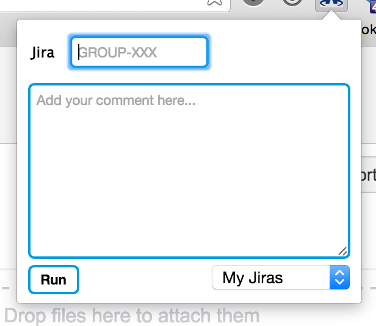
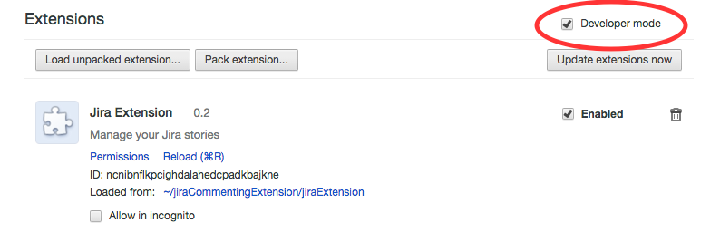
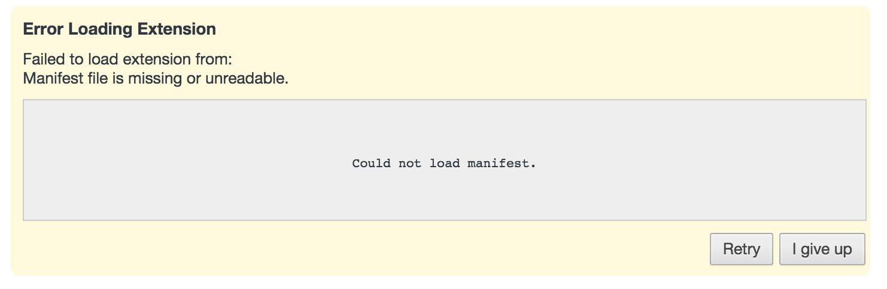

## Synopsis

An easy way to add notes to JIRA's that you have access to.

## Usage

* Jump to Jira issue in your current tab by entering the issue number or selecting from the dropdown and pressing 'enter' or by clicking the 'Run' button

## Installation

Clone repo into any directory.

In Chrome:

* go to manage your extensions: chrome://extensions
* enable 'Developer Mode', found in the top right corner of the page

* click 'Load unpacked extension...'
* navigate to the *jiraExtension* directory
* click 'Select'

## Upgrading to newer version

Simply pull down the new version (git pull), go to manage your extensions (chrome://extensions), and press the 'Reload' link: 

## Troubleshooting

### Trying to reload I get 'Error Loading Extension' message

This occurs when there has been a major change.  The extension is (most likely) working just fine, but you need to delete it and re-add it.

## Contributors

## License

>This program is free software: you can redistribute it and/or modify
>it under the terms of the GNU General Public License as published by
>the Free Software Foundation, either version 3 of the License, or
>(at your option) any later version.
>
>This program is distributed in the hope that it will be useful,
>but WITHOUT ANY WARRANTY; without even the implied warranty of
>MERCHANTABILITY or FITNESS FOR A PARTICULAR PURPOSE.  See the
>GNU General Public License for more details.
>
>You should have received a copy of the GNU General Public License
>along with this program.  If not, see <http://www.gnu.org/licenses/>.
